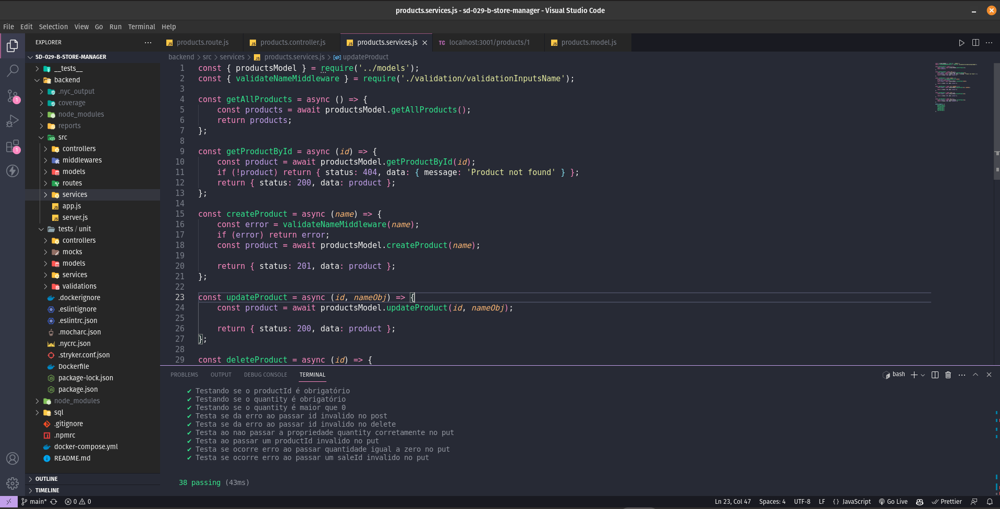

# :office: Store Manager! :office:

 

# :camera_flash: Imagens do Projeto

  
  

 

# :clipboard: About
O Projeto tem como objetivo as construção de uma API Restful, utilizando arquitetura MSC. A API trata de um sistema de vendas de produtos, registrando vendas, alterando, deletando e implementando, tudo conectado com o banco de dados relacional MySQL. Nele tambem existem as validações para garantir o bom funcionamento, e os testes com mocha, chai, e sinon, mantendo a estrutura confiavel.

 

# :hammer_and_wrench: Skills & Tools

- MySQL
- Docker
- Docker Compose
- Node.js
- Express
- Javascript
- Mocha / chai / sinon
- EsLint
- Arquitetura de camadas (MSC)

 

# :scroll: Nota

 
# :construction: To Implement :construction:

- Icon no favoritar / desfavoritas
